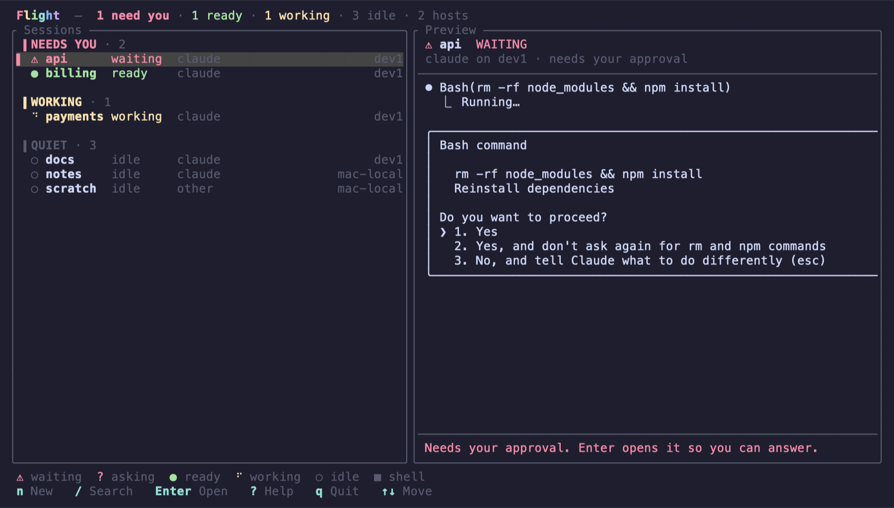
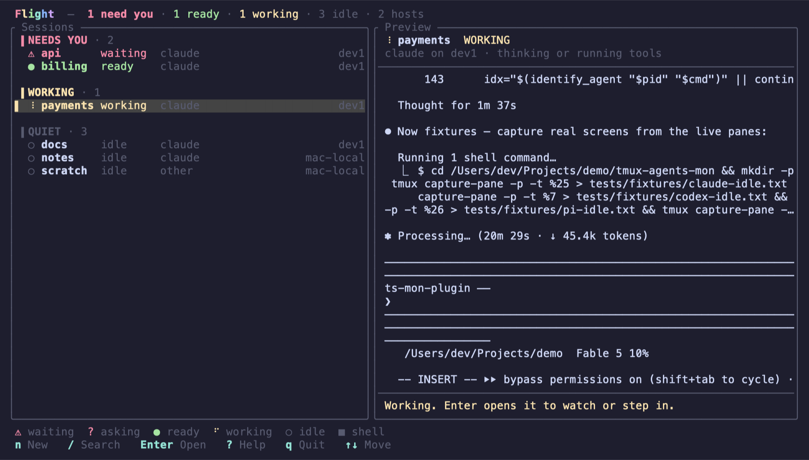
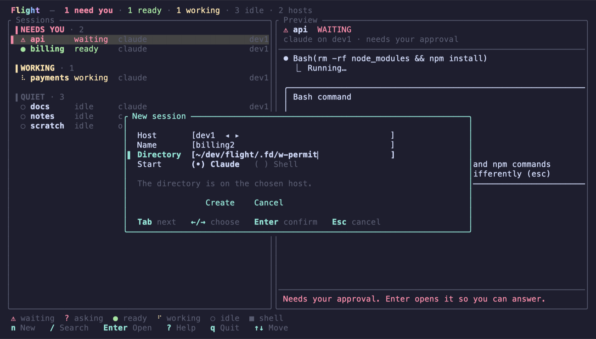
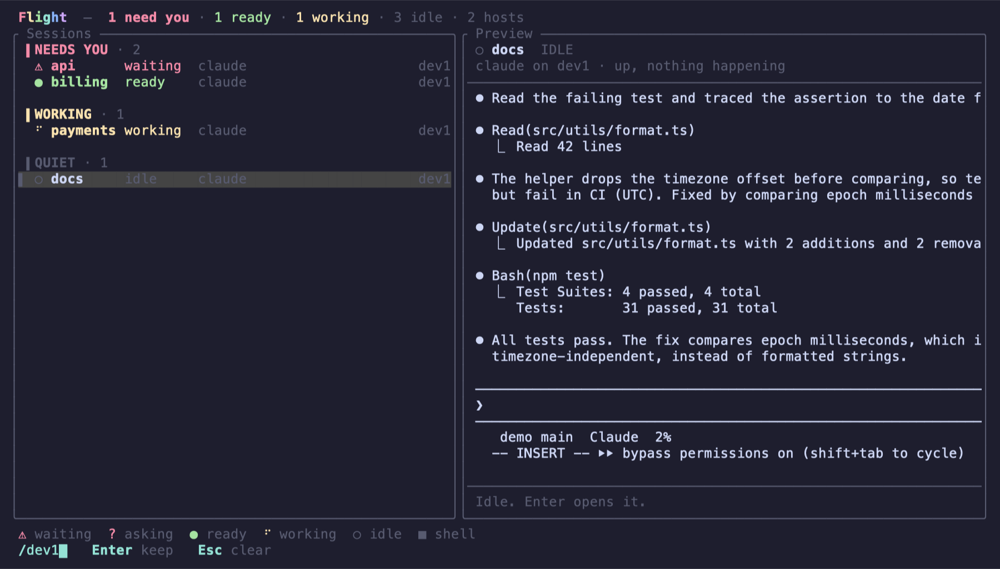
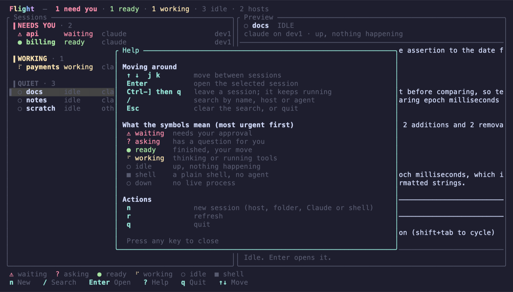
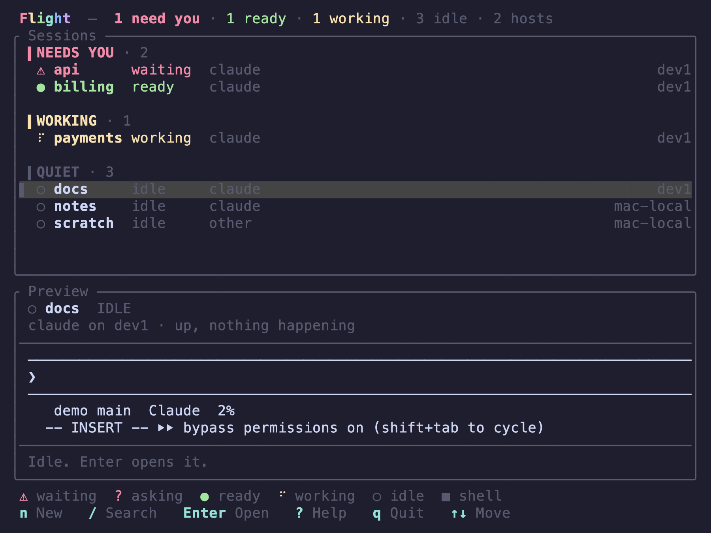
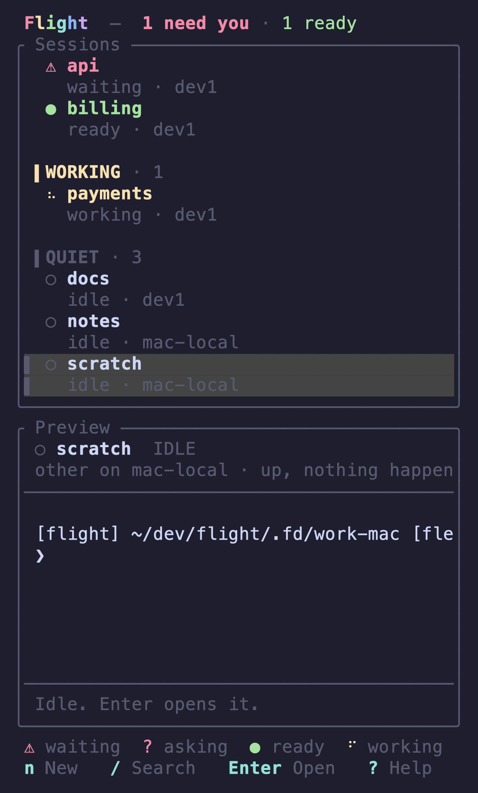
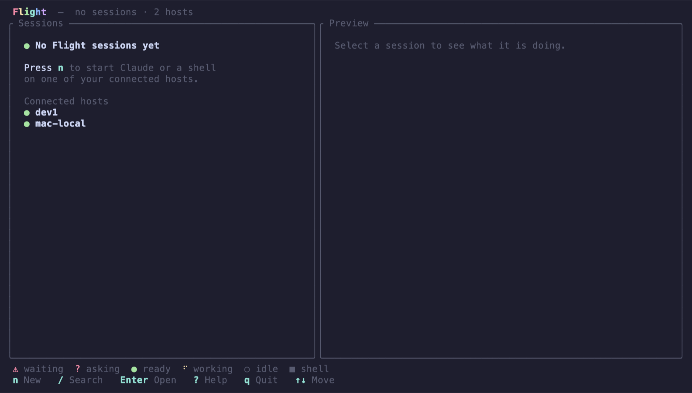

<!-- SPDX-License-Identifier: MIT -->

# ADR-006: Dashboard presentation (the Fleet model)

Status: Implemented. Scope: the Ratatui frontend only. No protocol, node, orchestrator or backend change.

Flight presents Hosts, Sessions, Agents, State, Attention and Preview. tmux is an internal execution/persistence backend and appears nowhere in the normal UI: no server, socket, pane or window vocabulary.

## Decision

The dashboard follows the visual and interaction model of nicknisi/fleet (`src/tui/dashboard.ts`, `render.ts`, `layouts/`, `preview.ts`, `help.ts`): one list of sessions, most urgent first, with a live preview of the selected one, a one-line summary on top, and controls always visible at the bottom.

| Fleet | Flight |
|---|---|
| header strip `N need you · N working · N ready · N idle` | `Summary` (view model), `header_line` |
| session row: bar, state icon, bold name, detail, age | `PaneView` row: bar, icon, bold name, state, agent, host (host dim, right-aligned) |
| urgency groups | `Tier` (Needs you, Working, Quiet) over `flight_state::sort_rank` |
| state glyphs and colours (⚠ ? ● ⠋ ○ ■) | `state_look`, spinner driven by the loop's tick |
| preview pane with state badge, content, quick actions | preview pane: name, state, agent and host, recent screen, one sentence about what Enter does |
| table layout / card layout below 48 columns | wide (side by side from 100 columns), stacked (list over preview), list only (under 20 rows); two-line cards under 44 columns |
| `/` filter on name, Claude name, path | `/` search on session name, host display name, agent kind |
| `?` overlay | help overlay: moving around, what the symbols mean, actions |
| legend line and key chips in the footer | legend line and `n New  / Search  Enter Open  ? Help  q Quit` |
| click selects, double-click opens, wheel scrolls, hover | click selects, a second click opens, wheel moves the selection |
| empty states that say why | no sessions (and which hosts are connected), no host connected, search matches nothing, connecting |

Not taken from Fleet: send, kill, rename, repo grouping, passthrough, the provenance overlay, divider dragging, hover underline. Each is its own feature.

## Rules

- One selectable list. The earlier two-section model (Attention, then a per-host tree, switched with Tab) is gone; the host is a column, not a hierarchy. Selection is still the identity of a pane, never a row.
- Order is state rank, then host (in snapshot order), then name. A host that is not healthy is listed after the sessions with its reason; it is not selectable.
- Counts in the header are over every session, not the search result.
- Every row, hint and message is Flight vocabulary. A test renders every screen, with every host health, and fails on `tmux`, `socket`, `pane`, `server`, `window` or a `%` pane id.
- Layout choice, row rendering and hit-testing are pure functions of the view model and the size (`layout_kind`, `list_view`, `session_at`), so clicks cannot disagree with what was drawn.

## Screens

Captured from the real dashboard running against a real orchestrator and two nodes (`mac-local`, `dev1`) on one machine, sessions created with `n`. Colours are the terminal's own palette.

| | |
|---|---|
| Wide dashboard; `api` is waiting, so attention is the first group and the preview is its screen |  |
| A working session selected, with its preview |  |
| New session |  |
| Search (`/dev1`) |  |
| Help |  |
| Narrow: list over preview, 80 columns |  |
| Narrower: two-line cards, 42 columns |  |
| Nothing yet |  |
